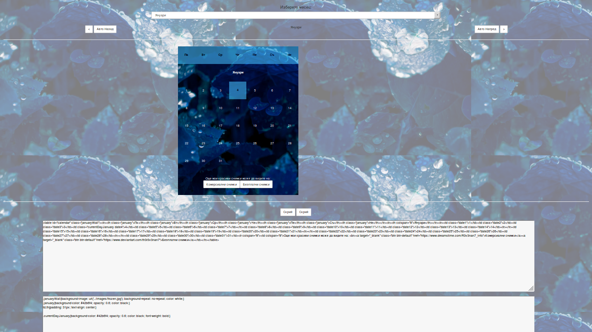
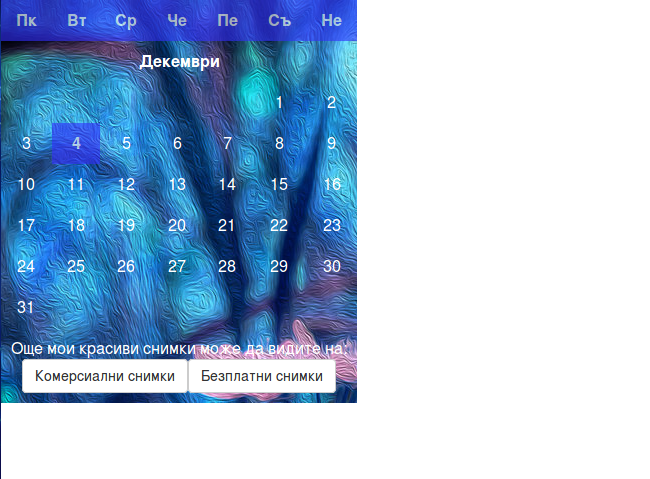
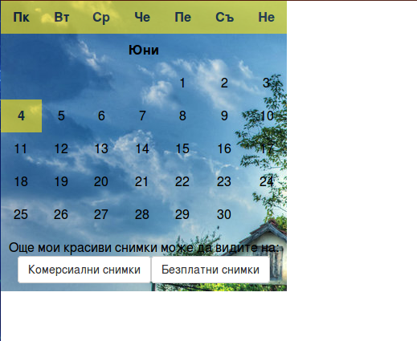

Simple calendar on bulgarian language with very nice background images and colors. Can show also the code of the generated table and it css rules. Also can automatically change months for the lazy ones. 

First image represents the appearence of the project. There are an select option to choose month for the current year. When you choose then the calendar for the choosed month will be generated.

There also buttons for seeing the previous and the next month. Also there is a key combination for that. Left Arrow key will bring the previous month until Right Arrow key will show the next one.

There is also an automatic mode. You can turn on automatic mode though one of the two buttons. Either button "Авто Назад" which will automatically begin to change months from the back. Other button "Авто напред" do the same thing but in reverse - from current month to the next. Both automation modes can be stoped like click one more time the clicked button, or key 'X'. There is also a key combination for the both automation modes. Arrow up button will turn on function which begin to change months from the current to the next and the Down Arrow key in the reverse order.

  

The second screenshot showing another functionality of the project - to show generated by javascript html code for the current month calendar table and the css rules used for creating it. You copy this code in your html file and to play with the css rules to make it your own way. The result of this action is shown on the third and forth images.

  

  
