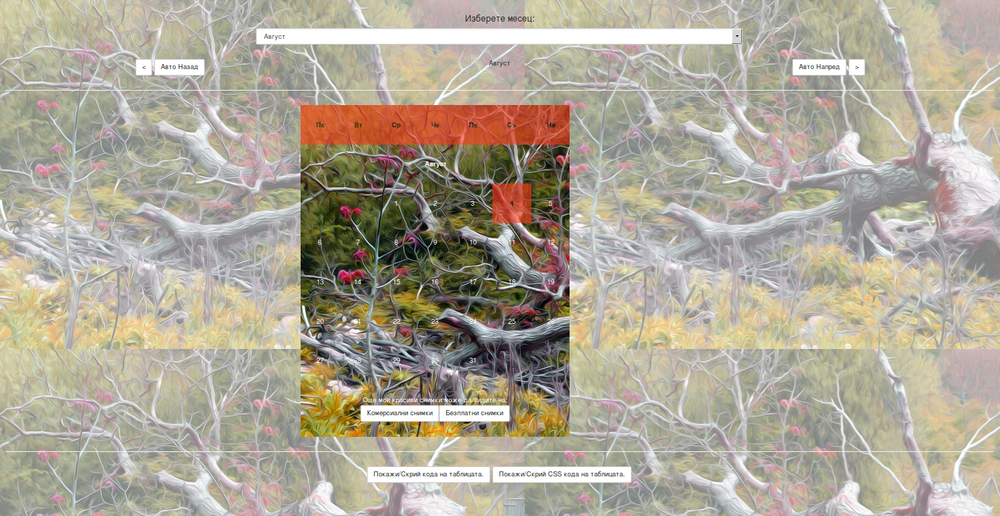

Simple calendar on bulgarian language with very nice background images and colors. Can show also the code of the generated table and it css rules. Also can automatically change months for the lazy ones. 

  
  
  
